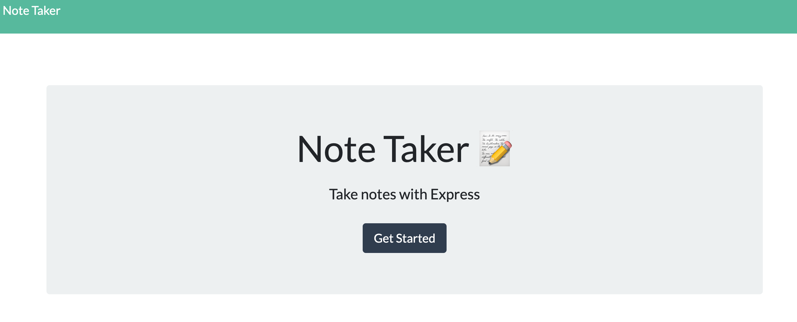
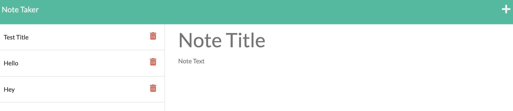

# Note-Taker

## Description

Created this application to be able to develop my Express.js coding skills and understanding of connection between front-end and back-end.

This application enables people to enter notes to their page.

## Access

The following link:

## Usage

When the page is first loaded it will look like this:

Once you click on the "Get Started" button you will be taken to the note section:

Then once you've filled in both the Title and Text section in the prompts, you can click the save button to add it to the list on the left!
